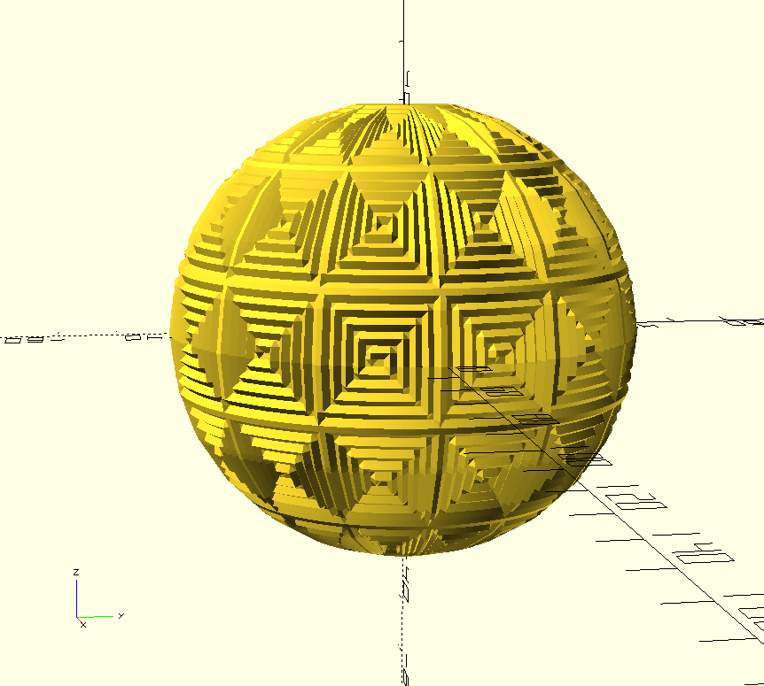
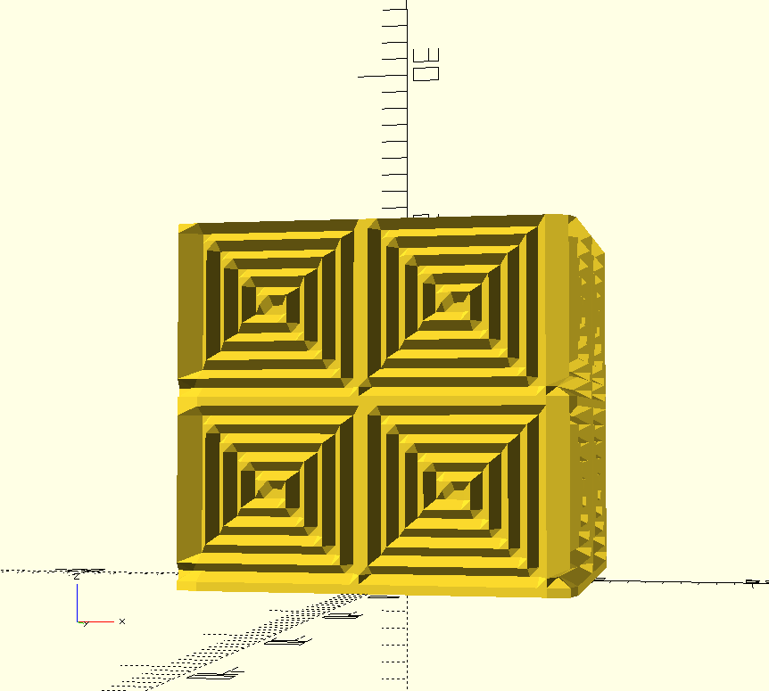

# OpenSCAD BOSL/2 Texture Editor

This tool is essentially a pixel editor for making OpenSCAD arrays that can be used as BOSL/2 textures in `linear_sweep()` , `rotate_sweep()`, `path_sweep()`, etc.

[A live version of the main branch is available here.](https://k-francis-h.github.io/openscad-texture-editor/) 

## How To Use

Use the mouse to paint your texture within the canvas.

The `Clear` button resets the canvas. 

The `Toggle Grid` button can be used to display a pixel grid for more precise editing.

The `Toggle Color` button can be used to toggle between white (1) and black (0) values. The button's background color will display the currently active color. In the future, I plan to add a color palette system so that values other than 0 and 1 can be used to make more complex 3D textures.

The `Resize Canvas` button opens a dialog to change the number of pixels represented in the editor. The default value is 20x20 pixels. Note that the canvas is sized to 800x800 real pixels. So the size of the pixel will equal 800 / N where N is the entered value in the `Resize Canvas` button dialog. 

## Importing Into OpenSCAD

When the `Export` button is clicked the OpenSCAD array will be copied to the clipboard. A preview of the code will also be shown below the canvas.

Then simply paste the array into OpenSCAD and use in conjunction with the [BOSL/2 sweep() functions](https://github.com/BelfrySCAD/BOSL2/wiki/skin.scad#function-texture). Set the `texture` parameter equal to the array you've just pasted and the `sweep()` function will texture your object.

## OpenSCAD Code Examples

### Spiral Texture with rotate_sweep()



```OpenSCAD
include <BOSL2/std.scad>
tex = [
	[1,1,1,1,1,1,1,1,1,1,1,1,1,1,1,1,1,1,1,1,],
	[1,0,0,0,0,0,0,0,0,0,0,0,0,0,0,0,0,0,0,1,],
	[1,0,1,1,1,1,1,1,1,1,1,1,1,1,1,1,1,1,0,1,],
	[1,0,1,0,0,0,0,0,0,0,0,0,0,0,0,0,0,1,0,1,],
	[1,0,1,0,1,1,1,1,1,1,1,1,1,1,1,1,0,1,0,1,],
	[1,0,1,0,1,0,0,0,0,0,0,0,0,0,0,1,0,1,0,1,],
	[1,0,1,0,1,0,1,1,1,1,1,1,1,1,0,1,0,1,0,1,],
	[1,0,1,0,1,0,1,0,0,0,0,0,0,1,0,1,0,1,0,1,],
	[1,0,1,0,1,0,1,0,1,1,1,1,0,1,0,1,0,1,0,1,],
	[1,0,1,0,1,0,1,0,1,0,0,1,0,1,0,1,0,1,0,1,],
	[1,0,1,0,1,0,1,0,0,0,0,1,0,1,0,1,0,1,0,1,],
	[1,0,1,0,1,0,1,1,1,1,1,1,0,1,0,1,0,1,0,1,],
	[1,0,1,0,1,0,0,0,0,0,0,0,0,1,0,1,0,1,0,1,],
	[1,0,1,0,1,1,1,1,1,1,1,1,1,1,0,1,0,1,0,1,],
	[1,0,1,0,0,0,0,0,0,0,0,0,0,0,0,1,0,1,0,1,],
	[1,0,1,1,1,1,1,1,1,1,1,1,1,1,1,1,0,1,0,1,],
	[1,0,0,0,0,0,0,0,0,0,0,0,0,0,0,0,0,1,0,1,],
	[1,1,1,1,1,1,1,1,1,1,1,1,1,1,1,1,1,1,0,1,],
	[0,0,0,0,0,0,0,0,0,0,0,0,0,0,0,0,0,0,0,1,],
	[1,1,1,1,1,1,1,1,1,1,1,1,1,1,1,1,1,1,1,1,],
];

path = arc(cp=[0,0], r=40, start=60, angle=-120);
rotate_sweep(
    path, closed=false,
    texture=tex, tex_size=[20,20],
    tex_depth=1, style="concave");
``` 

### Spiral Texture with linear_sweep()



```OpenSCAD
include <BOSL2/std.scad>
tex = [
	[1,1,1,1,1,1,1,1,1,1,1,1,1,1,1,1,1,1,1,1,],
	[1,0,0,0,0,0,0,0,0,0,0,0,0,0,0,0,0,0,0,1,],
	[1,0,1,1,1,1,1,1,1,1,1,1,1,1,1,1,1,1,0,1,],
	[1,0,1,0,0,0,0,0,0,0,0,0,0,0,0,0,0,1,0,1,],
	[1,0,1,0,1,1,1,1,1,1,1,1,1,1,1,1,0,1,0,1,],
	[1,0,1,0,1,0,0,0,0,0,0,0,0,0,0,1,0,1,0,1,],
	[1,0,1,0,1,0,1,1,1,1,1,1,1,1,0,1,0,1,0,1,],
	[1,0,1,0,1,0,1,0,0,0,0,0,0,1,0,1,0,1,0,1,],
	[1,0,1,0,1,0,1,0,1,1,1,1,0,1,0,1,0,1,0,1,],
	[1,0,1,0,1,0,1,0,1,0,0,1,0,1,0,1,0,1,0,1,],
	[1,0,1,0,1,0,1,0,0,0,0,1,0,1,0,1,0,1,0,1,],
	[1,0,1,0,1,0,1,1,1,1,1,1,0,1,0,1,0,1,0,1,],
	[1,0,1,0,1,0,0,0,0,0,0,0,0,1,0,1,0,1,0,1,],
	[1,0,1,0,1,1,1,1,1,1,1,1,1,1,0,1,0,1,0,1,],
	[1,0,1,0,0,0,0,0,0,0,0,0,0,0,0,1,0,1,0,1,],
	[1,0,1,1,1,1,1,1,1,1,1,1,1,1,1,1,0,1,0,1,],
	[1,0,0,0,0,0,0,0,0,0,0,0,0,0,0,0,0,1,0,1,],
	[1,1,1,1,1,1,1,1,1,1,1,1,1,1,1,1,1,1,0,1,],
	[0,0,0,0,0,0,0,0,0,0,0,0,0,0,0,0,0,0,0,1,],
	[1,1,1,1,1,1,1,1,1,1,1,1,1,1,1,1,1,1,1,1,],
];

linear_sweep(
    rect(20), texture=texspiral, h=20,
    tex_size=[10,10]
);
``` 